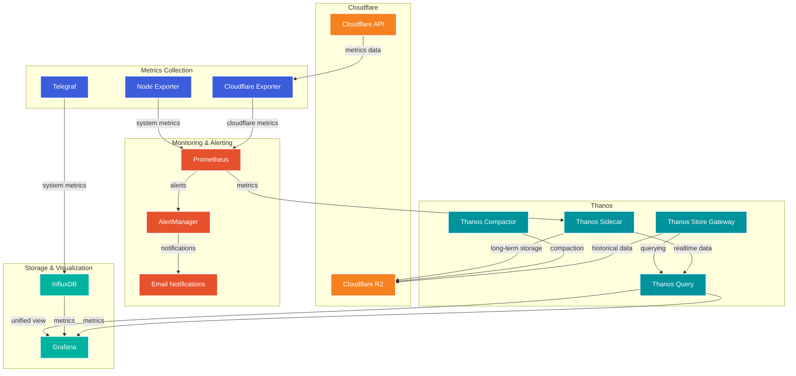
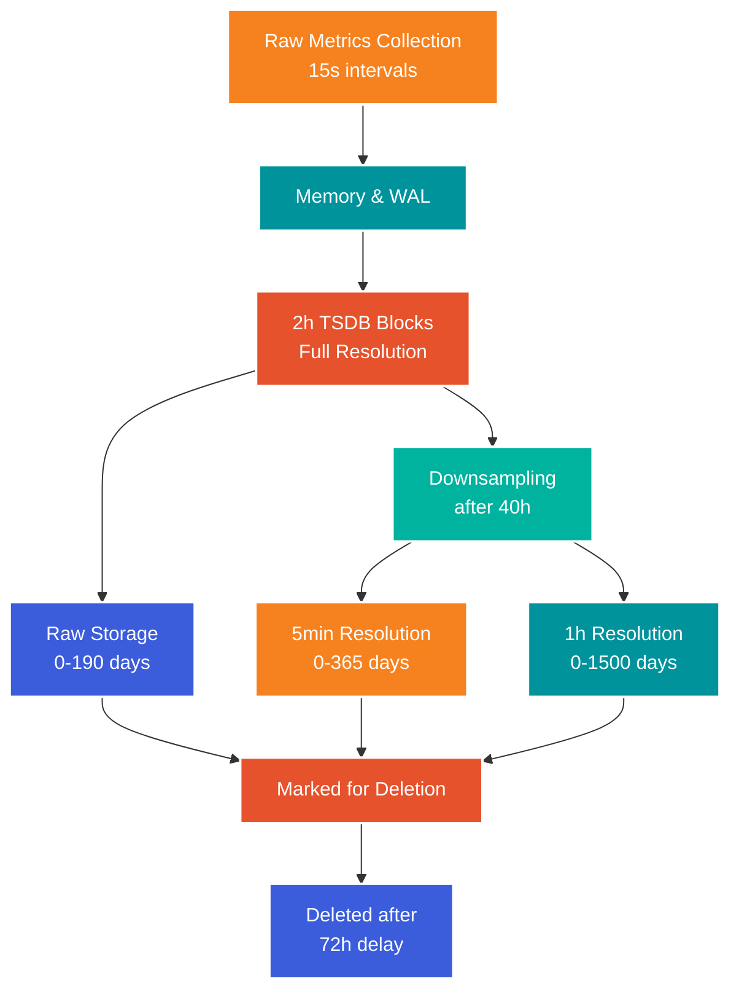

# Cloudflare & K6 Monitoring Grafana Prometheus Stack

This repository outlines my comprehensive monitoring stack designed to support performance testing with [k6](https://k6.io/) and Cloudflare Analytics monitoring for multiple Cloudflare domain zones within a Cloudflare account for Cloudflare HTTP Traffic, WAF Firewall, Workers, R2 S3 storage and Cloudflare Tunnel metrics. Though you will need a Cloudflare Pro plan or higher account if you want full analytics overview. It integrates several powerful tools, including [Prometheus](https://prometheus.io/), [Thanos](https://thanos.io/), [InfluxDB](https://www.influxdata.com/products/influxdb/), [Grafana](https://www.influxdata.com/products/influxdb/), and various exporters, to offer a scalable and robust solution for collecting, storing, and visualizing metrics.

## Table of Contents

- [Features](#features)
- [Architecture](#architecture)
- [n8n AI Agent Automation](#n8n-ai-agent-automation)

---

## Features

- **Scalable Metrics Storage**: Utilize Thanos components for long-term storage and horizontal scalability storing metrics in Cloudflare R2 S3 compatible object storage.
- **Rich Visualization**: Grafana dashboards for real-time and historical data analysis.
- **Integration with k6**: Seamless support for performance testing metrics (https://github.com/centminmod/k6-benchmarking).
- **Cloudflare Integration**: Collect metrics from Cloudflare using the [Cloudflare exporter](https://hub.docker.com/r/cyb3rjak3/cloudflare-exporter) and for Cloudflare Tunnels https://developers.cloudflare.com/cloudflare-one/tutorials/grafana/.
- **System Monitoring**: Node Exporter and Telegraf for comprehensive system metrics.
- **Alert Management**: Integrated AlertManager for sophisticated alert handling and email notifications.

## Screenshots

Cloudflare R2 metrics - including per R2 S3 bucket metrics.

Cloudflare Workers metrics - including per Cloudflare Worker script metrics.

Cloudflare API token permissions required. Note Bot Management is for Cloudflare Enterprise plans.

## Architecture

Metrics flow:

The stack consists of the following components:

1. **Prometheus**:
   - **Role**: Prometheus is the main monitoring and alerting toolkit in my setup. It scrapes metrics from various exporters and services, storing the time-series data in its local storage.
   - **Functionality**: Prometheus operates by pulling metrics at regular intervals from "exporters" (such as Node Exporter and Cloudflare Exporter) and HTTP endpoints. It supports flexible queries and alerting rules, allowing you to set conditions for alert generation.
   - **Storage and Retention**: Prometheus has a short-term storage design, which is ideal for recent data but less suited for long-term historical data storage. In my setup, Thanos extends Prometheus to provide a durable, scalable solution for longer retention.

2. **Thanos Sidecar**:
   - **Role**: The Thanos Sidecar runs alongside Prometheus, extending its capabilities by shipping Prometheus' metrics data to object storage (Cloudflare R2 in my case) for long-term retention.
   - **Functionality**: The sidecar component monitors Prometheus and uploads data to object storage once a block is complete (every 2 hours by default in Prometheus). It also provides a gRPC API, which allows the Thanos Query component to access data from the Prometheus instance.
   - **Benefits**: With Thanos Sidecar, you achieve scalable and cost-effective long-term storage without altering Prometheus. It also facilitates data federation, allowing multiple Prometheus instances to be queried together, which is particularly valuable in large, distributed environments.

3. **Thanos Store Gateway**:
   - **Role**: Thanos Store Gateway is a cache layer that retrieves and serves historical data stored in Cloudflare R2 (or other object storage).
   - **Functionality**: The Store Gateway downloads blocks on-demand from object storage and caches them locally, optimizing read performance for repeated queries on historical data. It responds to query requests made through the Thanos Query component, providing data access even after the data has aged out of Prometheus' local storage.
   - **Use Case**: This component is useful for environments where a lot of historical data needs to be queried without impacting Prometheus' performance. It enables efficient access to old data without overwhelming object storage or Prometheus.

4. **Thanos Query**:
   - **Role**: Thanos Query acts as a centralized querying layer across multiple Prometheus instances and Thanos components, providing a unified view of both real-time and historical data.
   - **Functionality**: It connects to various Thanos components (like Sidecar and Store Gateway) and aggregates data across all connected sources. This allows users to query data from multiple Prometheus instances as if they were a single dataset.
   - **Benefits**: Thanos Query enables high availability and redundancy in metric querying. If one Prometheus instance is down, Thanos Query can still fetch data from other instances, ensuring continuity in monitoring and alerting.

5. **Thanos Compactor**:
   - **Role**: The Thanos Compactor is responsible for compacting, deduplicating, and downsampling the data stored in object storage.
   - **Functionality**: The Compactor periodically processes the stored metrics data, combining smaller data blocks into larger ones (compaction) and downsampling old data to reduce storage costs. For example, it might aggregate data points from 15-second intervals to 1-minute intervals after a certain time threshold.
   - **Benefits**: This component helps maintain manageable storage sizes, improve query performance, and ensure data retention policies are met without excessive storage usage. Downsampling old data still preserves trends while reducing storage space.

6. **InfluxDB**:
   - **Role**: InfluxDB is a time-series database optimized for high-write loads, typically used in my setup for storing k6 test results and performance metrics.
   - **Functionality**: It supports flexible schemas, fast write and query speeds, and retention policies, making it ideal for high-precision time-series data like performance metrics from load testing tools.
   - **Use Case**: In my case, InfluxDB stores results from load tests conducted with k6, separate from Prometheus, which is more suited for infrastructure metrics. This segregation allows you to optimize data handling for both types of metrics.

7. **Telegraf**:
   - **Role**: Telegraf is an agent that collects metrics from various sources and sends them to InfluxDB, acting as a bridge between data sources and InfluxDB.
   - **Functionality**: Telegraf has a broad range of plugins for collecting system metrics (CPU, memory, disk usage), application metrics, and custom metrics from k6. It can also parse data in various formats and apply transformations before writing to InfluxDB.
   - **Advantages**: By using Telegraf, you can consolidate multiple data sources into InfluxDB, allowing you to analyze load test results alongside other metrics collected from different systems.

8. **Grafana**:
   - **Role**: Grafana is a visualization tool used to create dashboards and graphs for monitoring and analysis. It aggregates data from Prometheus and InfluxDB, giving you a centralized view of all metrics.
   - **Functionality**: Grafana allows for customizable dashboards with support for querying, alerting, and real-time data updates. It supports both PromQL (Prometheus Query Language) and Flux queries for InfluxDB, giving you flexible querying capabilities across both data sources.
   - **Use Case**: With Grafana, you can create unified dashboards that visualize infrastructure metrics from Prometheus, performance metrics from InfluxDB, and data from external sources like Cloudflare, all in one interface.

9. **Node Exporter**:
   - **Role**: Node Exporter is a Prometheus exporter that exposes hardware and operating system metrics for Linux systems.
   - **Functionality**: It collects low-level system metrics such as CPU usage, memory, disk I/O, filesystem statistics, and network usage, exposing them in a format that Prometheus can scrape.
   - **Use Case**: Node Exporter provides essential insights into server health, enabling you to track system performance and identify resource bottlenecks or anomalies in real time.

10. **Cloudflare Exporter**:
    - **Role**: The Cloudflare Exporter collects metrics from Cloudflare's API, exposing them in a format that Prometheus can scrape.
    - **Functionality**: This exporter retrieves data on Cloudflare’s service metrics, such as HTTP requests, cache usage, threats detected, and other Cloudflare-specific metrics that are useful for understanding application performance and security at the edge.
    - **Advantages**: Integrating Cloudflare metrics provides visibility into web traffic and security metrics, enabling you to monitor the health and performance of my Cloudflare-protected assets alongside other infrastructure components.

11. **AlertManager**:
    - **Role**: AlertManager handles alerts sent by Prometheus, providing sophisticated alert routing, grouping, and notification delivery.
    - **Functionality**: 
      - Manages alert deduplication and grouping to prevent notification spam
      - Routes alerts to different receivers based on severity levels (critical/warning)
      - Handles email notification delivery with secure SMTP configuration
      - Supports notification throttling and silencing
    - **Features**:
      - Configurable alert grouping to reduce noise
      - Separate routing for critical and warning alerts
      - Email templates for clear, actionable notifications
      - Integration with Prometheus alert rules for:
        - Cloudflare metrics monitoring
        - System resources (CPU, memory, disk)
        - Service availability
        - Metric collection health
    - **Benefits**: 
      - Reduces alert fatigue through intelligent grouping
      - Ensures critical issues are noticed and addressed promptly
      - Provides clear, actionable notifications via email
      - Helps maintain system reliability through early warning system

## Alert Rules

Each alert category is configured with appropriate severity levels and timing thresholds to minimize false positives while ensuring timely notification of genuine issues.

The monitoring stack includes several categories of alert rules:

1. **Cloudflare Monitoring**:
   - Cloudflare exporter availability
   - Worker request staleness detection
   - Critical metric absence monitoring

2. **Infrastructure Monitoring**:
   - Host memory utilization
   - High CPU load detection
   - Disk space monitoring
   - Node availability checks

3. **Service Health**:
   - Prometheus configuration reload status
   - AlertManager configuration status
   - Target scrape health
   - TSDB compaction issues

4. **System Resources**:
   - Memory usage thresholds
   - CPU utilization limits
   - Storage capacity warnings

This setup is highly modular and provides a comprehensive monitoring and visualization stack, enabling you to monitor and manage both system health and performance testing results in a unified view. Each component serves a specific role, contributing to scalability, historical data retention, and actionable insights for better system observability and performance.

## n8n AI Agent Automation

Now that I have Cloudflare Analytics metrics recorded by Prometheus server, I can setup a self-hosted [n8n.io](https://n8n.io/) running with PostgreSQL 17 database server instance workflow to create a n8n OpenAI AI Agent chat bot to be able to query my Prometheus server and grab my Cloudflare metrics for unique visitors, pageviews, requests, worker requests, bandwidth and R2 S3 object storage usage. I am using OpenAI's GPT 4o-mini model for OpenAI Agent.

